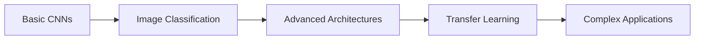

100_Cases_of_DeepLearning
# 🧠 100 Cases of Deep Learning

[](https://github.com/yourusername/100_Cases_of_DeepLearning)
[](https://www.python.org/)
[](https://www.tensorflow.org/)

> A comprehensive journey through 100 practical deep learning implementations, from fundamental CNNs to advanced architectures.

## 🎯 About This Repository

This repository contains hands-on implementations of deep learning algorithms, designed to bridge the gap between theory and practice. Each case study focuses on solving real-world problems with state-of-the-art neural network architectures.

## 📚 Project Structure

### 🖼️ Computer Vision

| Day | Project | Description | Key Concepts |
|-----|---------|-------------|--------------|
| **Day 1** | [CIFAR-10 Image Classification](CNNs%20for%20%20CIFAR10%20Image%20Classification%20Day%201/) | Building CNNs to classify 10 different object categories from color images | CNNs, Data Augmentation, Multi-class Classification |
| **Day 2** | [MNIST Digit Recognition](CNNs%20for%20MNIST%20Digits%20Classification%20Day%202/) | Handwritten digit classification using deep neural networks | Image Processing, CNN Architecture, Model Optimization |

## 🚀 Getting Started

### Prerequisites

```bash
pip install tensorflow numpy matplotlib pandas jupyter
```

### Running the Projects

1. Clone the repository:
```bash
git clone https://github.com/yourusername/100_Cases_of_DeepLearning.git
cd 100_Cases_of_DeepLearning
```

2. Navigate to any project folder:
```bash
cd "CNNs for CIFAR10 Image Classification Day 1"
```

3. Open the Jupyter notebook:
```bash
jupyter notebook
```

## 🎓 Learning Path



### Beginner 🌱
- Day 1-10: Fundamental CNN architectures
- Learn basics of image classification
- Understand neural network training

### Intermediate 🌿
- Day 11-50: Advanced architectures (ResNet, VGG, etc.)
- Transfer learning and fine-tuning
- Working with different datasets

### Advanced 🌳
- Day 51-100: State-of-the-art models
- Custom architecture design
- Production deployment strategies

## 💡 Key Features

- ✅ **100 Practical Implementations** - Real-world deep learning projects
- ✅ **Well-Documented Code** - Clear explanations and comments
- ✅ **Jupyter Notebooks** - Interactive learning experience
- ✅ **Progressive Difficulty** - From basics to advanced concepts
- ✅ **Industry-Ready Skills** - Production-level implementations

## 📊 Technologies & Frameworks

- **Deep Learning:** TensorFlow, Keras, PyTorch
- **Data Processing:** NumPy, Pandas, OpenCV
- **Visualization:** Matplotlib, Seaborn
- **Environment:** Jupyter Notebook, Python 3.8+

## 🎯 Project Goals

1. Master fundamental deep learning concepts
2. Implement 100 different use cases
3. Build a comprehensive portfolio
4. Gain hands-on experience with real datasets
5. Prepare for deep learning interviews

## 📈 Progress Tracker

- [x] Day 1: CIFAR-10 Classification
- [x] Day 2: MNIST Digit Recognition
- [ ] Day 3-100: Coming Soon...

## 🤝 Contributing

Contributions are welcome! Feel free to:
- Report bugs
- Suggest new project ideas
- Improve documentation
- Share your implementations

## 📝 License

This project is licensed under the MIT License - see the LICENSE file for details.

## 🌟 Acknowledgments

- Inspiration from 100 Days of Code challenge
- Deep Learning community
- Open source contributors

## 📞 Connect

- GitHub: [@yourusername](https://github.com/yourusername)
- LinkedIn: [Your Profile](https://linkedin.com/in/yourprofile)
- Email: your.email@example.com

---

⭐ **Star this repo** if you find it helpful! 

💪 **Happy Learning!**
